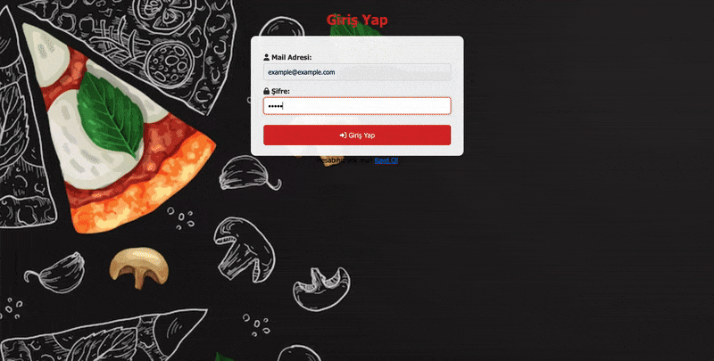

# PizzaAPI Project 🍕



Bu proje, modern web geliştirme prensipleri kullanılarak geliştirilmiş, full-stack bir **Pizza Sipariş ve Yönetim Sistemi**dir. Güçlü bir Node.js backend altyapısı ve kullanıcı dostu bir Vanilla JavaScript frontend arayüzünden oluşur.

## 🌟 Özellikler

*   **Dinamik Ürün Yönetimi:** API üzerinden anlık çekilen pizza çeşitleri ve dinamik fiyatlandırma.
*   **Sipariş Oluşturma:** Boyut seçimi (Küçük, Orta, Büyük, vb.), adet belirleme ve anlık toplam tutar hesaplama.
*   **Kullanıcı Deneyimi:** Form doğrulama, görsel geri bildirimler (Toastify) ve modal pencereler ile akıcı bir arayüz.
*   **Backend Altyapısı:** RESTful API mimarisi, JWT tabanlı kimlik doğrulama, Loglama (Morgan/Winston) ve E-posta bildirim servisi (Nodemailer).
*   **Veri Tabanı:** MongoDB ve Mongoose ile ilişkisel veri modelleme.
*   **Dokümantasyon:** Swagger ve Redoc ile otomatik oluşturulmuş, test edilebilir API dokümantasyonu.

## 🛠 Kullanılan Teknolojiler ve Yöntemler

*   **Core:** Node.js, Express.js, MongoDB (Mongoose), JavaScript (ES6+).
*   **Security:** `jsonwebtoken` (JWT Auth), `cors` (Cross-Origin Resource Sharing).
*   **Data Handling:** `fetch` API (Frontend-Backend Communication), JSON.
*   **Documentation:** `swagger-autogen`, `swagger-ui-express`, `redoc-express`.
*   **Utilities:** `nodemailer` (E-mail Service), `multer` (File Upload), `dotenv` (Environment Variables).

## 📂 Proje Yapısı

```
/
├── client/            # Frontend Uygulaması
│   ├── index.html     # Sipariş Arayüzü
│   ├── login.html     # Giriş Sayfası
│   ├── script.js      # Uygulama Mantığı ve API İstekleri
│   └── style.css      # Özelleştirilmiş Tasarım
│
└── server/            # Backend API Servisi
    ├── src/           # Kaynak Kodlar (Controllers, Models, Routes)
    ├── logs/          # Uygulama Logları
    ├── uploads/       # Yüklenen Dosyalar
    ├── index.js       # Sunucu Giriş Noktası
    └── swaggerAutogen.js # API Dokümantasyon Oluşturucu
```

## 🚀 Kurulum

### Backend (Sunucu) Kurulumu
1.  `server` klasörüne gidin:
    ```bash
    cd server
    ```
2.  Gerekli bağımlılıkları yükleyin:
    ```bash
    npm install
    ```
3.  Ortam değişkenlerini (`.env`) ayarlayın (Veritabanı bağlantısı vb. için).
4.  Sunucuyu başlatın:
    ```bash
    npm start
    # veya geliştirme modunda:
    nodemon
    ```
    *Sunucu varsayılan olarak `http://127.0.0.1:8000` adresinde çalışacaktır.*

### Frontend (İstemci) Kurulumu
1.  `client` klasörüne gidin.
2.  `index.html` dosyasını bir tarayıcıda açın.
    *   *Öneri:* VS Code kullanıyorsanız, **Live Server** eklentisi ile `Go Live` diyerek projeyi başlatın.
3.  Frontend, API isteklerini varsayılan olarak tanımlı sunucu adresine gönderecektir.
